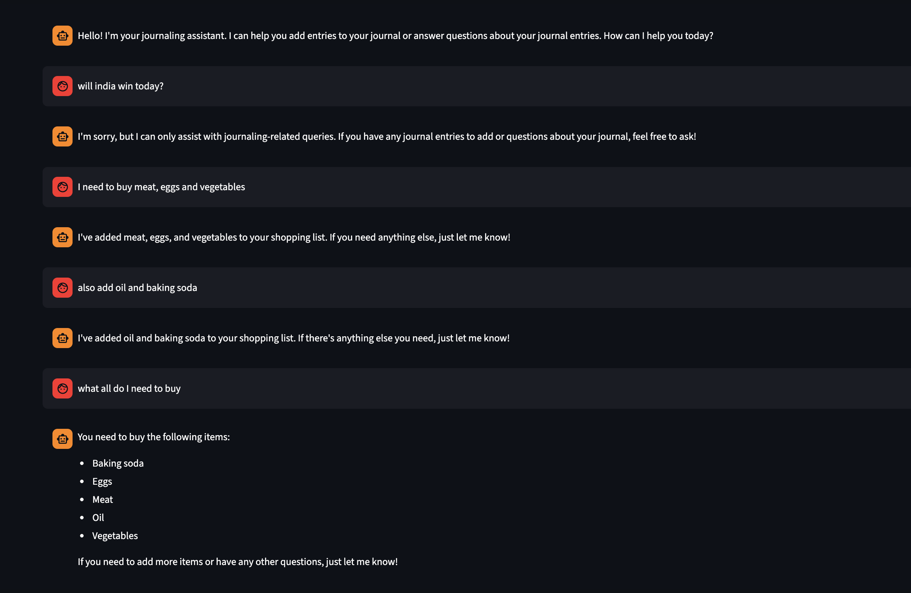
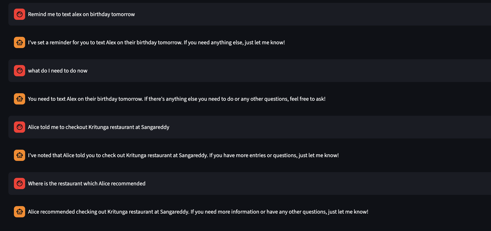

# Journal Chat App

A Streamlit-based journaling application with an AI chat interface that allows users to add journal entries and query them using natural language.




## Features

### Adding Journal Entries
Users can add entries through natural language prompts:
- "Remind me to buy eggs next time I'm at the supermarket"
- "Alice says 'I should check out Kritunga for their awesome biryani'"
- "Note: Meeting with John tomorrow at 3 PM"

### Querying Journal Entries
Users can query their journal with questions like:
- "What is my shopping list?"
- "I'm at the supermarket. What should I buy?"
- "What did I note about Alice?"
- "Show me all my reminders"

## How It Works

### Overview
The app uses a LangChain agent with OpenAI function calling to intelligently route user messages to the appropriate journal operations. The agent understands user intent and either adds entries to the journal or queries existing entries using semantic search.

### Step-by-Step Flow

1. **User Input**: User sends a message through the Streamlit chat interface

2. **Agent Processing**: The LangChain agent (powered by GPT-4o-mini) processes the message:
   - Analyzes the user's intent
   - Determines if it's a journal-related query
   - Selects the appropriate tool to use

3. **Function Calling**: The agent calls one of two tools:
   - **`add_journal_entry`**: When user wants to record something
     - LLM extracts category (shopping, reminder, quote, note, general)
     - LLM extracts shopping items if applicable
     - Entry is stored with embedding for semantic search
   - **`query_journal`**: When user asks about existing entries
     - Agent determines category filter based on intent (shopping, reminder, or none)
     - Performs hybrid search (vector + keyword) on filtered entries
     - Returns formatted results

4. **Semantic Search**: For queries, the system:
   - Generates embeddings for the query using OpenAI's text-embedding-3-small
   - Compares against stored entry embeddings using cosine similarity (70% weight)
   - Performs keyword matching on content and categories (30% weight)
   - Returns top-k most relevant entries

5. **Response Generation**: The agent formats the results and returns a natural language response to the user

### Key Components

**LangChain Agent**: Orchestrates the conversation flow and tool selection using OpenAI's function calling API.

**Journal Manager**: Handles entry storage, embedding generation, and hybrid search operations.

**Vector Search**: Each journal entry is automatically embedded when added, enabling semantic understanding of queries beyond exact keyword matches.

**Category Filtering**: The agent intelligently filters queries by category (shopping, reminder, or all) to improve relevance and response quality.

**Chat History Management**: Implements a sliding window - maintains full history in UI but only sends the most recent 10 message pairs to the model to stay within prompt limits.

## Implementation

### Technology Stack
- **Framework**: Streamlit
- **AI Model**: OpenAI GPT-4o-mini with function calling
- **Agent Framework**: LangChain with OpenAI Tools Agent
- **Embeddings**: OpenAI text-embedding-3-small for semantic search
- **Storage**: In-memory (Streamlit session state)

### Architecture
- **`app.py`**: Main Streamlit application with chat interface and LangChain agent
- **`journal_manager.py`**: Journal entry management with vector search capabilities

## Notes

- Uses GPT-4o-mini by default for cost efficiency (can be changed to GPT-4 in `app.py`)
- Journal entries are categorized automatically (shopping, reminder, quote, note, general)
- Chat history and entries stored in Streamlit session state (lost on page refresh)
- Chat history truncated to most recent 10 message pairs to fit within prompt limits

## Setup

1. **Install dependencies:**
   ```bash
   pip install -r requirements.txt
   ```

2. **Set up OpenAI API key:**
   Create a `.env` file in the project root:
   ```
   OPENAI_API_KEY=your_api_key_here
   ```

3. **Run the application:**
   ```bash
   streamlit run app.py
   ```
